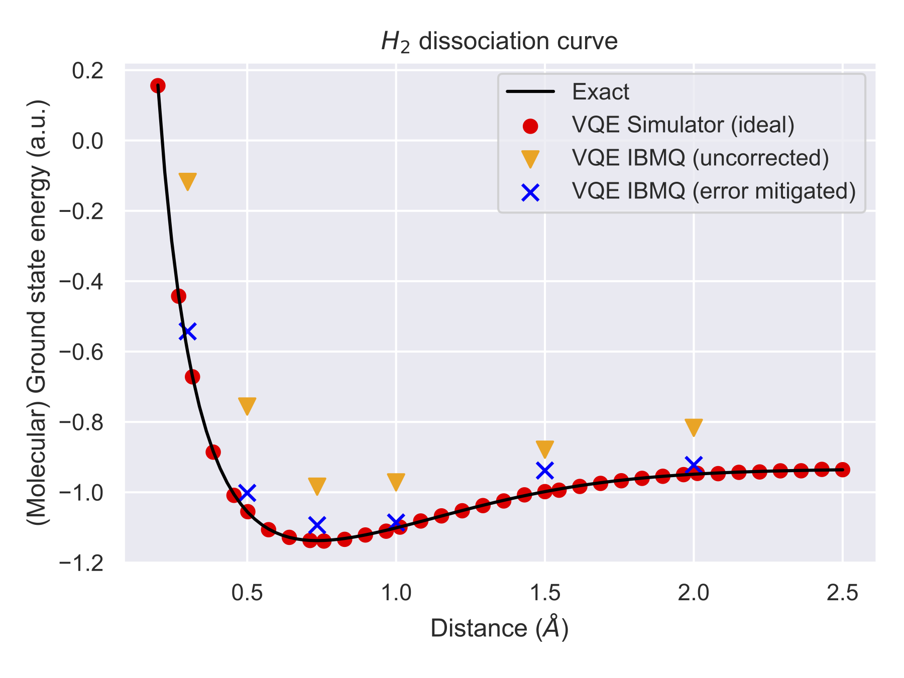

# QSciTech-QuantumBC Virtual Workshop 2023: Quantum Chemistry with Gate-Based Quantum Computing Using IBM Quantum

My implementation of the Variational Quantum Eigensolver (VQE) applied to the $H_2$ molecule can be found in this repository. This was created during the QSciTech-QuantumBC Virtual Workshop 2023. 

In detail, the following is covered:

VQE experiments on both the ideal QASM simulator and IBM Quantum Computers for different bond distances in the H2 molecule.
IBM-Q implementation trough Qiskit runtime so that error mitigation techniques can be easily activated (see `resilience_level` and documentation <https://qiskit.org/documentation/partners/qiskit_ibm_runtime/how_to/error-mitigation.html>).

Additionally, for comparison, the exact solution for the ground state energy is computed through diagonalization of the Hamiltonian.

### Results:

Three main results (see plot below)
1. Simulated VQE matches exact solutions ●
2. (Uncorrected) IBMQ overestimates ▼
3. Error mitigation improves IBMQ results by mitigating the overestimation **x**

### Poster:

See my team's poster on the project here: 
[Final poster.pdf](https://github.com/Jonas-Jaeger/QuantumChemistryWorkshop/files/10703407/Final.poster.pdf)

Special thanks to my team members for the good collaboration!

### Disclaimer: 
This implementation served the purpose to understand and learn the concepts involved in this Quantum Chemistry application for (Gate-based) IBM Quantum Computers. IBQ already provides complete implementations for VQE including molecule mappings to qubits in Qiskit. Please refer to <https://qiskit.org/textbook/ch-applications/vqe-molecules.html> and for details using the Qiskit Runtime <https://qiskit.org/documentation/partners/qiskit_ibm_runtime/tutorials/vqe_with_estimator.html> 

Implementation by **Jonas Jäger** <jojaeger@cs.ubc.ca>

### File overview:

Description of the files (beyond the original template files as listed below): 
- dissociation_vals.csv: Contains experimental results
- experiments.ipynb: Performs VQE experiments on both the ideal QASM simulator and IBM Quantum Computers for different bond distances in the H2 molecule and computes exact results.
- plot.pdf: Plot showing the experimental results compared to the exact dissociation curve (PDF)
- plot.png: Plot showing the experimental results compared to the exact dissociation curve (PNG)
- plots.ipynb: Plots the experimental results

### Acknowledgements:
Me and my team sincerely thank CMC, QsiTech, QuantumBC for this informative workshop, and IBM for providing the quantum hardware.

## Original template description

Notebook template by **Maxime Dion** <maxime.dion@usherbrooke.ca> 

Incomplete version of the suggested solution to find the ground state of a molecule using quantum computing.

Description of the files :
- hamiltonian.py : This files defines the FermionicHamiltonian class and subclasses. You should be able to partially complete it after the lecture on second quantization. The 'to_linear_combinaison_pauli_string' methods can be completed after the lecture on mapping.
- pauli_string.py : Defines PauliString and LinearCombinaisonPauliString class. You should be able to complete it after the lecture on mapping. The 'to_matrix' method is optional.
- mapping.py : Defines the JordanWigner mapping. You should be able to complete it after the lecture on mapping.
- estimator.py : Defines the abstract class Estimator and the BasicEstimator class. You should be able to complete it after the lecture on VQE.
- solver.py : Defines VQESolver and ExactSolver. You should be able to complete it after the lecture on VQE. The ExactSolver is optionnal.

Other files :
- Integrals_sto-3g_H2_d_0.7350_no_spin.npz : Contains the one body and two body integrals (no spin) for a H2 molecule with d=0.735. The two body is given in the physicist order.
- activity_mapping_.ipynb and activity_vqe_.ipynb : Tutorial Jupyter notebooks to help you code the concepts seen in the respective activities.
